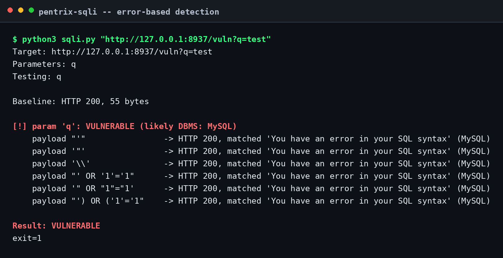
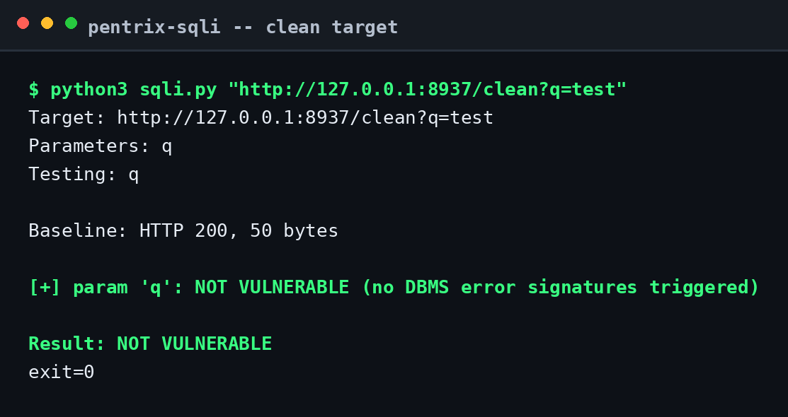
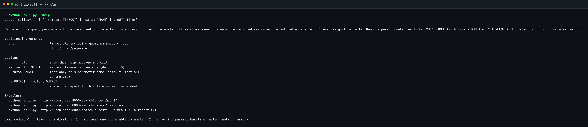

# pentrix-sqli

[](https://www.python.org/)
[](#install)
[](#dbms-signature-table)
[](LICENSE)

A tiny error-based SQL injection prober. It sends classic break-out payloads
to each query parameter of a URL, compares each response against the
unmodified baseline request, and matches response bodies against a table of
DBMS error signatures to flag the parameter as vulnerable and guess the
database engine.

Detection only: it never extracts data, bypasses authentication, or sends
anything destructive.

## Contents

- [Features](#features)
- [Screenshots](#screenshots)
- [DBMS signature table](#dbms-signature-table)
- [Install](#install)
- [Usage](#usage)
  - [Examples](#examples)
  - [Sample output](#sample-output)
- [How it works](#how-it-works)
- [Ethical use](#ethical-use)
- [License](#license)

## Features

- Tests every query parameter, or a single one with `--param`
- Compares against a baseline request to avoid false positives from pages
  that always contain error-like text
- DBMS fingerprinting: MySQL, PostgreSQL, MSSQL, Oracle, SQLite
- Reads error pages returned with 4xx/5xx status codes, not just 200s
- Clear per-parameter verdicts: `VULNERABLE` (with likely DBMS) or `NOT VULNERABLE`
- Sensible exit codes for scripting: `0` clean, `1` vulnerable found, `2` error
- Report export with `-o/--output`
- Zero dependencies: Python 3 standard library only

## Screenshots

**Positive detection: a parameter flagged VULNERABLE with MySQL identified.**
A local test server returns a canned MySQL error page whenever a quote
appears in a parameter; the tool matches it against the signature table.



**Clean target: no DBMS error signatures triggered.**



**Built-in help (`python3 sqli.py --help`).**



## DBMS signature table

| DBMS | Matched signatures |
|------|--------------------|
| MySQL | `You have an error in your SQL syntax`, `mysql_fetch`, `MySQL server`, `Warning: mysql_`, `mysqli::` |
| PostgreSQL | `pg_query()`, `unterminated quoted string`, `PostgreSQL`, `pg_fetch_` |
| MSSQL | `Unclosed quotation mark`, `Microsoft SQL Server`, `ODBC SQL Server`, `SqlException`, `ODBC Microsoft Access Driver` |
| Oracle | `ORA-`, `Oracle error`, `Oracle() query` |
| SQLite | `sqlite3`, `SQLITE_ERROR`, `near "syntax error"`, `SQLite3::` |

A signature only counts when it appears in a payload response but not in the
baseline response, so pages that mention errors in normal text are not
flagged.

## Install

```bash
git clone https://github.com/mizazhaider-ceh/pentrix-sqli.git
cd pentrix-sqli
```

No install step, no pip, no `requirements.txt`. You need Python 3
(uses only `urllib`, `argparse`, `re` from the standard library).

## Usage

```
python3 sqli.py [-h] [--timeout TIMEOUT] [--param PARAM] [-o OUTPUT] url
```

- `url` (positional): target URL including query parameters
- `--timeout`: request timeout in seconds (default: 10)
- `--param`: test only this parameter name (default: test all parameters)
- `-o`, `--output`: also write the report to a file

### Examples

Test all parameters of a URL:

```bash
python3 sqli.py "http://localhost:8000/search?q=test&id=1"
```

Test a single parameter and save the report:

```bash
python3 sqli.py "http://localhost:8000/search?q=test" --param q -o report.txt
```

Shorter timeout for slow targets:

```bash
python3 sqli.py "http://localhost:8000/search?q=test" --timeout 5
```

### Sample output

Against a vulnerable parameter (local test server returning a canned
MySQL-style error when it sees a quote; see the screenshot above):

```
Target: http://127.0.0.1:8937/vuln?q=test
Parameters: q
Testing: q

Baseline: HTTP 200, 55 bytes

[!] param 'q': VULNERABLE (likely DBMS: MySQL)
    payload "'"                -> HTTP 200, matched 'You have an error in your SQL syntax' (MySQL)
    payload '"'                -> HTTP 200, matched 'You have an error in your SQL syntax' (MySQL)
    payload '\\'               -> HTTP 200, matched 'You have an error in your SQL syntax' (MySQL)
    payload "' OR '1'='1"      -> HTTP 200, matched 'You have an error in your SQL syntax' (MySQL)
    payload '" OR "1"="1'      -> HTTP 200, matched 'You have an error in your SQL syntax' (MySQL)
    payload "') OR ('1'='1"    -> HTTP 200, matched 'You have an error in your SQL syntax' (MySQL)

Result: VULNERABLE
```

Against a clean endpoint that just echoes the input:

```
Target: http://127.0.0.1:8937/clean?q=test
Parameters: q
Testing: q

Baseline: HTTP 200, 50 bytes

[+] param 'q': NOT VULNERABLE (no DBMS error signatures triggered)

Result: NOT VULNERABLE
```

Error handling (no parameters, unreachable host):

```
$ python3 sqli.py "http://127.0.0.1:8937/clean"
Error: URL has no query parameters to test

$ python3 sqli.py "http://127.0.0.1:8999/clean?q=test" --timeout 2
Error: baseline request failed: request failed: Connection refused
```

## How it works

1. Fetch the URL as-is: this is the baseline.
2. For each query parameter, send it six classic break-out payloads
   (`'`, `"`, `\`, `' OR '1'='1`, `" OR "1"="1`, `') OR ('1'='1`) while
   keeping the other parameters unchanged.
3. If a payload response contains a DBMS error signature that the baseline
   did not, the parameter is flagged `VULNERABLE` and the most frequently
   matched DBMS is reported as the likely engine.

## Ethical use

Only probe applications you own or have explicit written permission to test.
This tool performs error-based probing only: it detects verbose SQL error
messages and does not extract, modify, or delete any data. Unauthorized
testing, even with a "harmless" scanner, is illegal in most jurisdictions.
You are responsible for how you use this tool.

## License

MIT. See [LICENSE](LICENSE).
